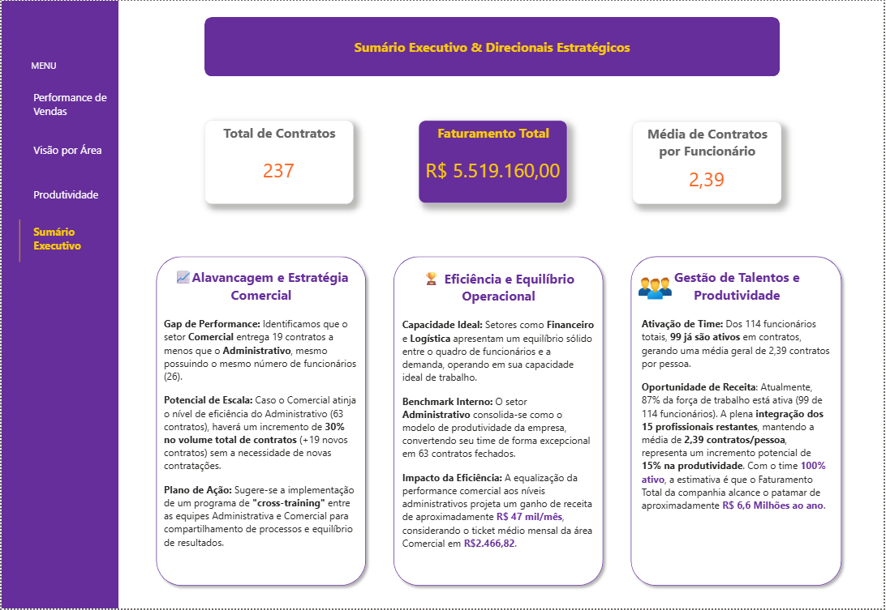
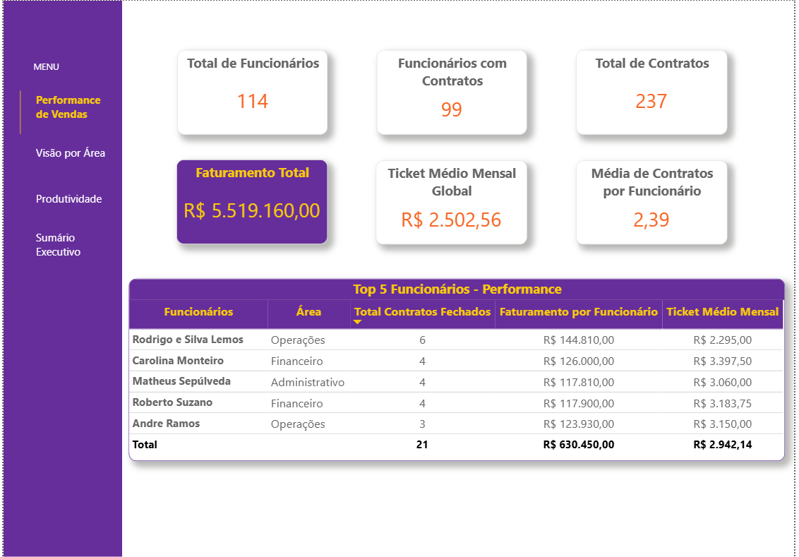
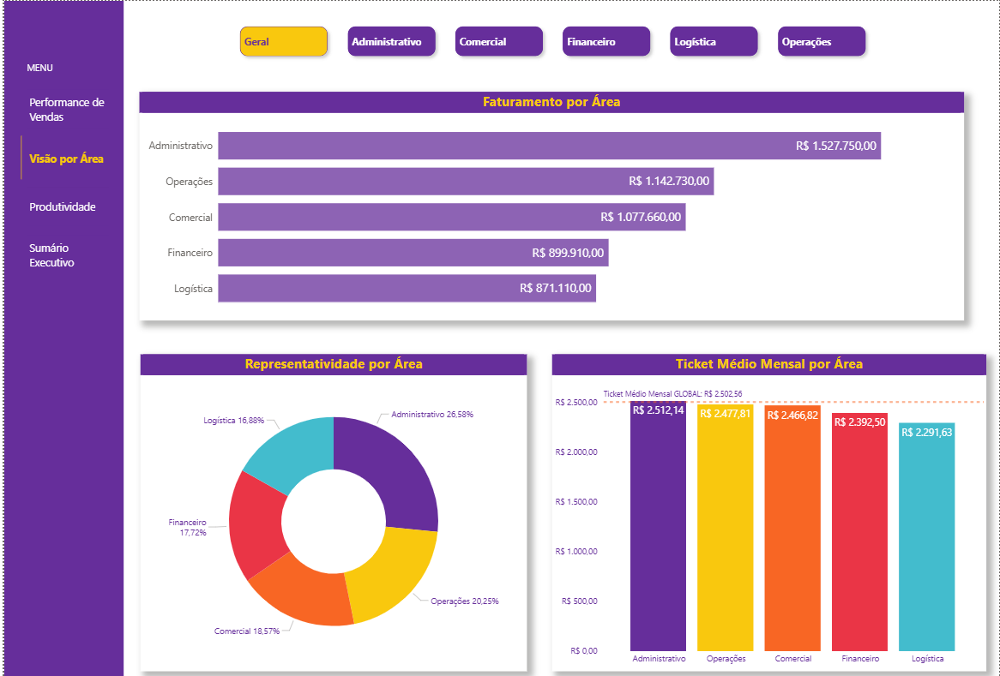
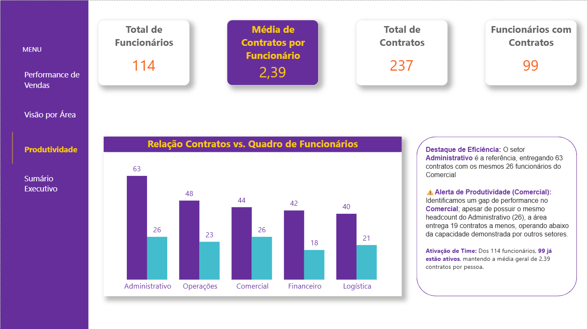

📊 Dashboard de Performance Multifatorial (Python & Power BI)

📋 Sobre o Projeto
Este projeto representa uma análise end-to-end, unindo o poder de processamento do Python com a excelência visual do Power BI. A estrutura foi desenhada seguindo princípios de UX Design e a lógica da Pirâmide Invertida, onde o Sumário Executivo atua como o ponto de partida estratégico, seguido pelo detalhamento técnico.

🏗️ Metodologia e Governança de Dados

Um diferencial deste projeto foi a fase de Conciliação e Auditoria de Dados:

Integridade Referencial: Identificou-se uma variação controlada entre o faturamento calculado em Python (R$ 5,62M) e o Power BI (R$ 5,52M). Essa diferença reflete critérios de filtragem mais rigorosos no dashboard para exibir apenas contratos com status de "Faturamento Confirmado".

💡 Estratégia de Validação: Neste projeto, realizei o tratamento de dados em duas frentes: utilizei Python para uma auditoria inicial e tratamento de tipos, e repliquei a lógica no Power Query para garantir que o Dashboard fosse autossuficiente e validado por dupla checagem.

Scalability & Flexibilidade: O uso de .merge(how='left') e .groupby().size() em Python garantiu que nenhum registro fosse perdido durante a fase de ETL, permitindo uma visão holística da base bruta antes da aplicação das regras de negócio no BI.

📈 Visualização do Dashboard
1. Sumário Executivo & Direcionais Estratégicos
A "Home" do projeto foca em insights acionáveis.

Insight: Identificquei que a plena integração dos 15 profissionais restantes pode elevar o faturamento anual de R$ 5,5 Milhões para R$ 6,6 Milhões.

2. Performance de Vendas
Visão detalhada dos Top Performers e KPIs Globais.

Benchmark de Talento: O setor de Operações destaca-se por abrigar o colaborador com maior carteira ativa (6 contratos), servindo de modelo para o programa de cross-training sugerido.

3. Visão por Área & Produtividade
Gráficos comparativos de Ticket Médio e relação Contratos vs. Quadro de Funcionários.

Nota Técnica: No Power BI, optou-se pela escala decimal (2,39 contratos/pessoa) para facilitar a leitura executiva, mantendo a integridade com a taxa percentual calculada no modelo Python (239%).

 

🛠️ Tecnologias e Origem dos Dados

Fontes de Dados: Integração de múltiplos datasets em formatos .csv (Base de Funcionários e Clientes) e .xlsx (Base de Serviços Prestados).

Python (Pandas & Matplotlib): Realizei o processo de ETL, o tratamento de tipos de dados distintos e a análise visual exploratória para validação de hipóteses.

Power BI: Desenvolvi a modelagem relacional, a criação de medidas em DAX e o design dos dashboards interativos.

(Obs: A aba Laboratório foi mantida como página oculta no arquivo .pbix para fins de validação técnica e futuras expansões de métricas.)
